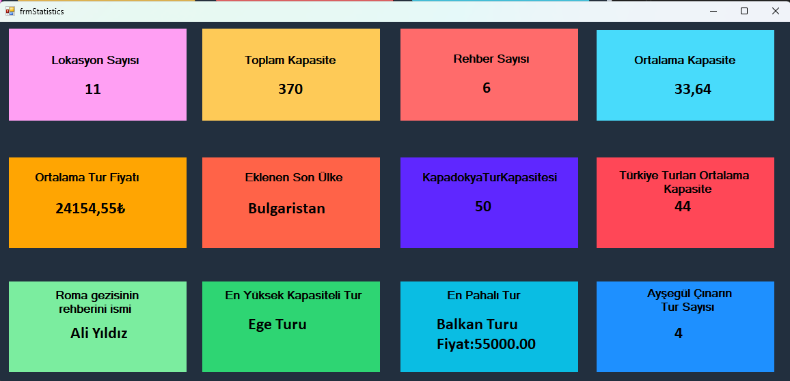

# 🔆 C# EĞİTİM KAMPI PROJELERİ

**Bu depo, [Murat Yücedağ'ın](https://www.youtube.com/@MurattYucedag) rehberliğinde katıldığım C# Eğitim Kampı’nda tamamladığım projeleri barındırıyor. Her proje, C# programlama, problem çözme ve öğrendiklerimi uygulama anlamında bana çokça katkıda bulundu. Aşağıda, projelere dair teknik ayrıntıları inceleyebilirsiniz:**

## 📀 Proje 1: Temel Kavramlar – Yazdırma Komutları ve Değişkenler

Bu derste `Console.WriteLine()` ile konsol ekranına mesaj yazdırmayı ve string/int türünde değişken tanımlayarak değer atamayı öğrendim . Restoran menüsü örneğiyle gerçek dünya senaryolarında değişkenleri kullanarak pratik yaptım 🍔.
**[Proje 1 »](01_MainSubjects/01_MainSubjects/Program.cs)**

## 📀 Proje 2: Variables – Double, Char ve Veri Girişi

Bu derste `double` türünde değişken tanımlayarak ondalıklı sayılarla fiyat hesaplamayı öğrendim 💰. `char` ile tek karakteri temsil eden verilerin kullanımını deneyimledim ⌨️. `Console.ReadLine()` ve `Parse` metodlarıyla string girdileri `int`, `double` ve `char` tiplerine dönüştürerek kullanıcıdan veri almayı pekiştirdim 🔄.
**[Proje 2 »](01_MainSubjects/02_Variables/Program.cs)**

## 📀 Proje 3: MakingDecision – Karar Yapıları ve Switch Case

Bu derste `if-else` bloklarıyla koşul yapılarını öğrendim. `mod` operatörü ile sayıların tek/çift kontrolü ve kalan hesaplama uygulamaları yaptım 🔢. `switch-case` yapısını kullanarak menü seçimleri ve dört işlemli hesap makinesi projesi geliştirdim ➕➖✖️➗.
**[Proje 3 »](01_MainSubjects/03_MakingDecision/Program.cs)**

## 📀 Proje 4: Loops – Döngülerle Tekrarlı İşlemler

Bu derste `for` ve `while` döngüleriyle belirli şartlarda tekrarlı kod çalıştırmayı öğrendim. Döngülerde if ile tek/çift sayıları ve belirli katları kontrol ettim 🔢. Sayı toplama, saat bazlı bakteri çoğalması ve kullanıcı girdisi ile çalışacak örnek sınav sorusu çözümleriyle pratiğimi güçlendirdim 💪.
**[Proje 4 »](01_MainSubjects/04_Loops/Program.cs)**

## 📀 Proje 5: LoopsWithStars – Yıldızlarla Şekil Çizme

Bu derste iç içe `for` döngüleriyle yıldız karakterleri kullanarak farklı şekiller (dik üçgen, elmas, piramit, baklava) oluşturmayı öğrendim ⭐️.
**[Proje 5 »](01_MainSubjects/05_LoopsWithStars/Program.cs)**

## 📀 Proje 6: Arrays – Dizilerle Veri Yönetimi

Bu derste `array` ile birden fazla veriyi tek yapıda saklamayı öğrendim 📚. Döngülerle elemanları listeleyip en büyük ve en küçük değerleri buldum. Kullanıcı girdisiyle diziyi doldurup tek/çift sayıları ayırarak etkileşimli bir uygulama geliştirdim ✨.
**[Proje 6 »](01_MainSubjects/06_Arrays/Program.cs)**

## 📀 Proje 7: ForeachLoops – Kolay Koleksiyon Gezinme

**`foreach` ile dizi, liste ve string’lerde hızlıca dolaştım. Öğrenci notlarını toplayıp ortalamaları hesaplayarak geçme/kalma durumlarını listeledim 🎓.**
**[Proje 7 »](01_MainSubjects/07_ForeachLoop/Program.cs)**

## 📀 Proje 8: Methods – Modüler ve Dinamik Metotlar

**Void metotlarla tekrar eden kodları azalttım. Parametreli ve geriye değer döndüren metotlarla hem metin hem sayı işlemleri yaptım 🧩. Sınav sonuçlarını hesaplayıp koşullu dönüşlerle uygulamayı esnek hale getirdim 🎯.**
**[Proje 8 »](01_MainSubjects/08_Methods/Program.cs)**

## 📀 Proje 9: DatabaseProject – Veri Tabanı Entegrasyonu

Bu projede ADO.NET ile veritabanına bağlanıp verileri listeledim .  `ConfigurationBuilder`, `SqlConnection` ve `SqlDataAdapter` kullanarak modüler bir yapı oluşturdum. Kendimden de bir şeyler katmak istediğim için  `try-catch-finally` ile hataları yöneterek uygulamanın kararlılığını artırdım ve bağlantı ayarlarını `appsettings.json` dosyasından güvenle okudum .
**[Proje 9 »](01_MainSubjects/09_DatabaseCrud/Program.cs)**

## 📀 Proje 10: DatabaseCrud

Bu projede, `temel CRUD (Create, Read, Update, Delete)` işlemlerini ADO.NET kullanarak geliştirdim. Veritabanı bağlantı bilgilerini güvenlik açısından `appsettings.json` dosyasında saklayıp yapılandırma aracı ile uygulamaya entegre ettim.
**[Proje 10 »](01_MainSubjects/10_DatabaseCrud/Program.cs)**

## 📀 Proje 11: OOP

Bu projede `OOP` temelerine `SOLID prensiplerinden Single Responsibility` üzerine bilgi sahibi oldum. Aynı zamanda proje için gerekli `Entity - DataAccess - Business ve Presentation `katmanlarını oluşturdum.
**[Proje 11 »](CSharpEgitimKampi301/)**

## 📀 Proje 12: Data Access Katmanı ve Context Sınıfı

Bu projede nesne yönelimli programlama (OOP) ve Entity Framework kullanarak dört katmanlı bir mimari (Entity, DataAccess, Business, Presentation) geliştirdim.

`🔗` KampContext sınıfı aracılığıyla `Entity Framework'ün DbSet<>` yapısıyla tablolar tanımladım ve veritabanı ile doğrudan bağlantı kurmasını sağladım.

`📦` Entity katmanında `sınıflar arası ilişkiler` (örneğin, ürün–kategori ve ürün–sipariş ilişkileri) kurarak veri modeli tasarladım.

`🔄` Katmanlar arası doğru referans yönü (Presentation > Business > DataAccess > Entity) kullanarak, bağımlılıkları kontrollü ve modüler bir yapıda yönettim.

`✅` Sonuç olarak, sürdürülebilir, ölçeklenebilir ve okunabilir bir mimariyle profesyonel yazılım geliştirme becerilerimi somutlaştırdım.**[Proje 12 »](CSharpEgitimKampi301/CSharpEgitimKampi301.DataAccessLayer/Context/KampContext.cs)**

## 📀 Proje 13: Generic Interface - Migrations İşlemleri

Bu aşamada, Entity Layer'da tanımladığım sınıfları kullanarak Entity Framework’ün **Code First** yaklaşımı ile SQL veritabanını otomatik olarak oluşturdum.

💡 **Yapılanlar:**

* 🛠️ **Code First** yöntemiyle migration işlemleri gerçekleştirilerek veri tabanı yapısı oluşturuldu.
* 📁 Data Access Layer içinde `Abstract` klasörü altında **IGenericDal** adında generic bir interface tanımlandı.
* 🔁 Her bir entity için özel interface’ler oluşturularak `IGenericDal<T>` üzerinden kalıtım sağlandı.
* 🧩 Bu yapı ile tekrar eden kodlar azaltıldı, sistem daha modüler hale getirildi.

🔧 Bu mimari sayesinde hem **bağımlılık yönetimi** daha etkin hale geldi hem de projenin **bakımı ve genişletilmesi** kolaylaştırıldı.
**[Proje 13 »](CSharpEgitimKampi301/)**

## 📀 Proje 14 - 15
Bu 2'sinin birleşiminde ORM'in ne olduğu hakkında bilgi sahibi olmakla kalmayıp Entity Framework gibi ORM yapısını da anladım. Aynı zamanda bir form üzerinde `Database First` methodunu kullanarak basit sql sorguları gerekmeden sadece entity framework yardımı ile bir form CRUD projesi hazırladım.

## 📀 Proje 16 - 17 LINQ VE ENTITY FRAMEWORK

C# Eğitim kampı içerisinde geliştirmiş olduğumuz projemizde LİNQ sorguları ve Entity Framework yapısını kullanarak bir proje hazırladık. Bu projede bir seyehat acentası ile ilgili olası istatistikler ürettik. 

## 📀 Proje 18 - 19

Bir GenericRepository tanımladım. Sonrasında bu sınıf ile tüm entity'ler için ortak CRUD işlemlerini generic olarak gerçekleştirmesini sağladım. Business katmanı ve birkaç kural eklendi. Form yapısı düzenlendi.

## CSharpEgitimKampi601

Form üzerinde MongoDB kullanarak CRUD işlemleri gerçekleştirdik. Bununla birlikte mssql dışında bir veritabanı deneyimi elde etmiş oldum.
#### -> PostgreSQL de CRUD işlemleri de projeye eklendi.